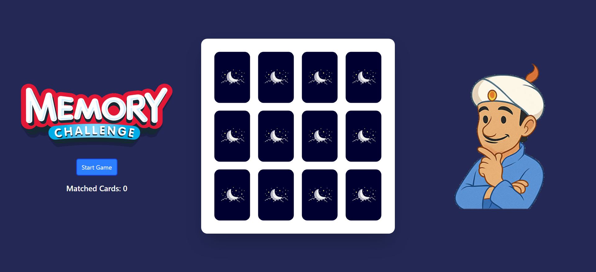
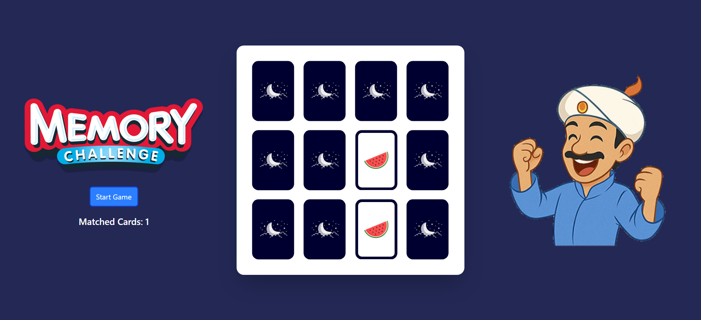
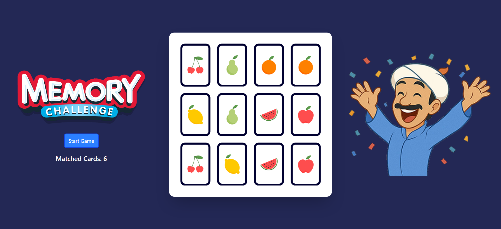

# 🧠 Memory Game

Bu proje, React ve Tailwind CSS kullanarak geliştirdiğim interaktif bir hafıza oyunudur. Hem React becerilerimi pekiştirmek hem de portföyüme eğlenceli bir proje eklemek amacıyla tasarladım. Oyun, kullanıcı etkileşimini artıran dinamik animasyonlar ve görsel geri bildirimlerle zenginleştirilmiştir.

## 🎮 Oyun Özellikleri

- **4x3 Kart Düzeni:** Toplam 12 kart, rastgele karıştırılarak yerleştirilir.
- **Start Game Butonu:** Oyunu başlatır ve kartları yeniden karıştırır.
- **Eşleştirme Sayacı:** Doğru eşleştirilen kart sayısını gösterir.
- **Karakter Animasyonu:** Sağda yer alan karakter, her doğru eşleşmede sevinir ve tüm kartlar eşleştirildiğinde kutlama yapar.

## 🛠️ Kullanılan Teknolojiler

- **React** – UI bileşenlerini oluşturmak için
- **Tailwind CSS** – Hızlı ve modern stil uygulamaları için

## 📸 Ekran Görüntüleri






## 🚀 Kurulum ve Çalıştırma

Projeyi kendi bilgisayarınızda çalıştırmak için aşağıdaki adımları izleyin:

```bash
git clone https://github.com/furkan-karapinar/Memory-Game-React.git
cd Memory-Game-React
npm install
npm run dev
